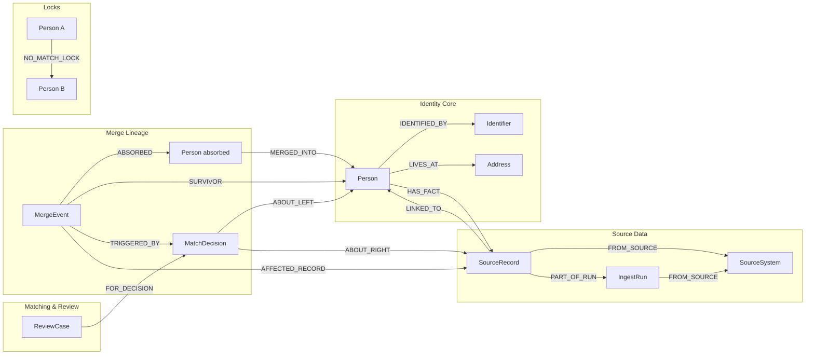
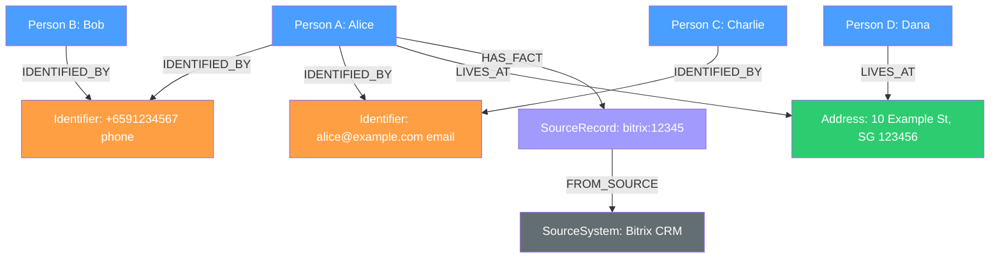
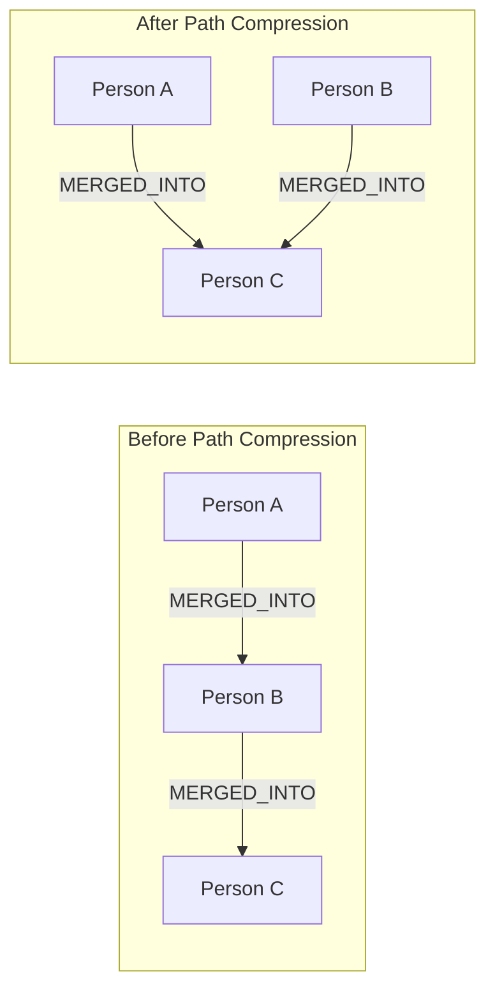
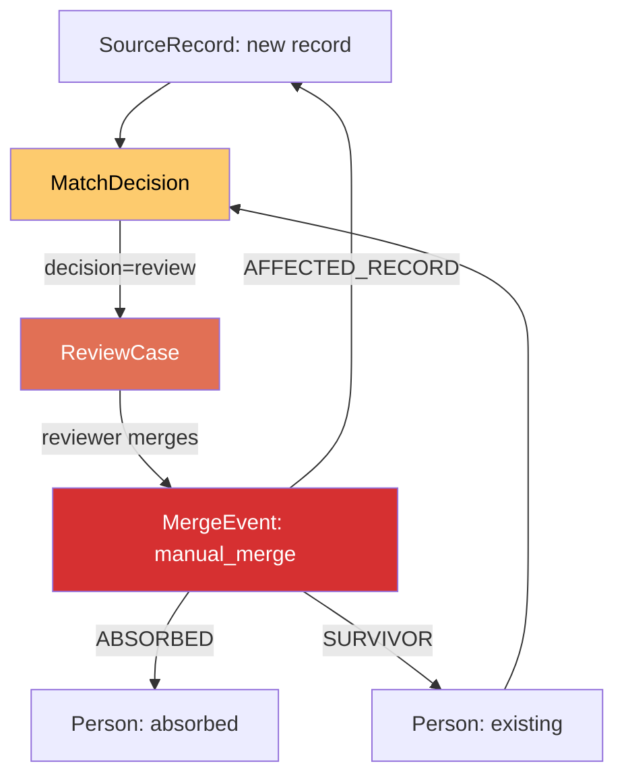
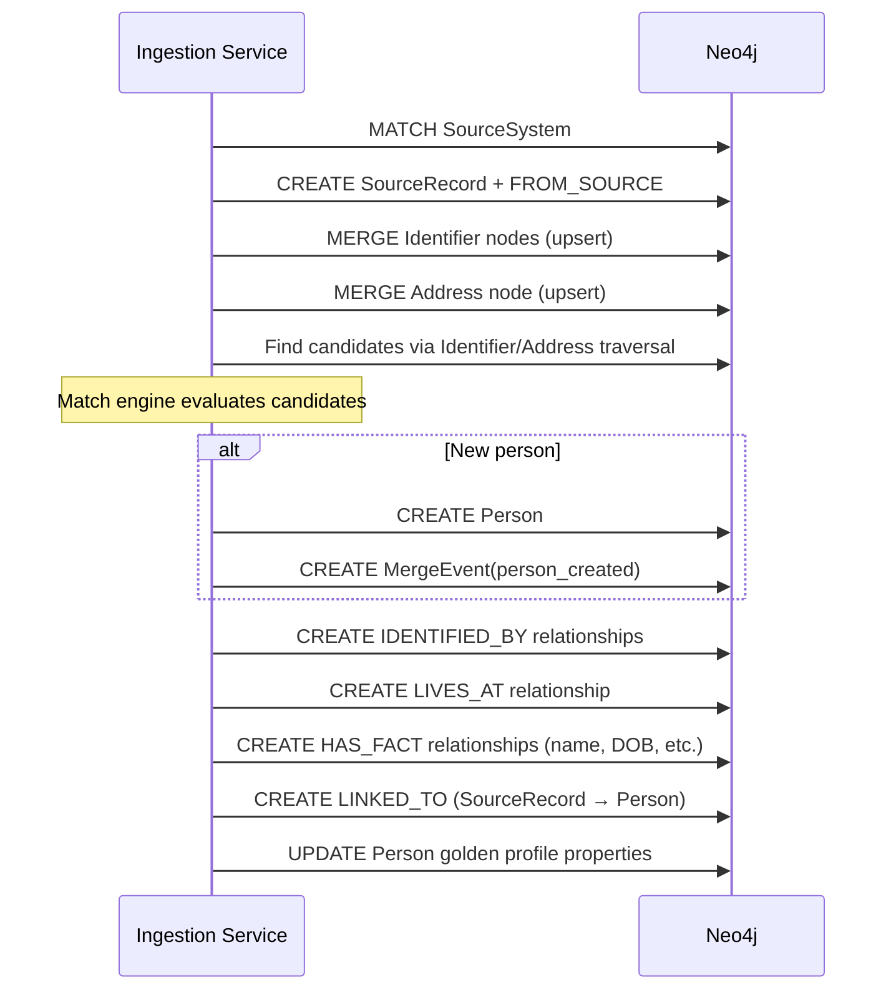
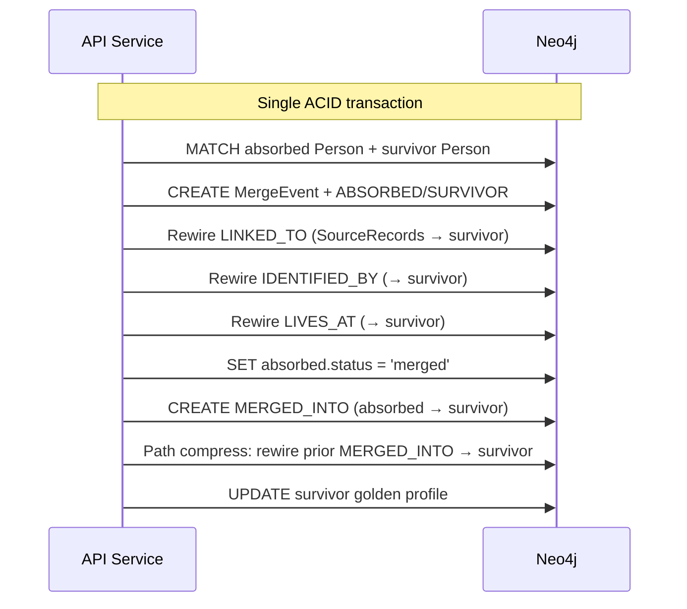

# Profile Unifier Graph Model Diagram

## Purpose

Visual reference for how Neo4j nodes and relationships connect. Use alongside
the [graph schema](./profile-unifier-graph-schema.md) for property-level
detail.

## Full Graph Model

## Identity Subgraph (Detail)

How persons connect through shared Identifier and Address nodes — the
foundation for contact tracing.

Reading this diagram:

- **Alice and Bob** share a phone — connected through the same Identifier node
- **Alice and Charlie** share an email — connected through another Identifier
- **Alice and Dana** share an address — connected through the same Address node
- Contact tracing from Alice reaches Bob (1 hop via phone), Charlie (1 hop
  via email), and Dana (1 hop via address)

## Merge Lineage Subgraph

How merge history and path compression work.

Path compression rewires all `MERGED_INTO` relationships to point directly to
the final survivor. Max 1 hop to resolve any person to its canonical form.

## Match and Review Subgraph

How decisions, review cases, and merge events connect.

## Ingestion Write Flow

Order of operations when a new source record is ingested.

## Merge Write Flow

Order of operations when two persons are merged.

## Node Relationship Summary

| From | Relationship | To | Cardinality | Notes |
| --- | --- | --- | --- | --- |
| Person | IDENTIFIED_BY | Identifier | many-to-many | shared identifiers are the graph backbone |
| Person | LIVES_AT | Address | many-to-many | shared addresses enable household detection |
| Person | HAS_FACT | SourceRecord | many-to-many | attribute observations (name, DOB, etc.) |
| Person | MERGED_INTO | Person | many-to-one | max 1 hop after path compression |
| Person | NO_MATCH_LOCK | Person | many-to-many | always left_id < right_id |
| SourceRecord | LINKED_TO | Person | many-to-one | one person per source record |
| SourceRecord | FROM_SOURCE | SourceSystem | many-to-one | provenance |
| SourceRecord | PART_OF_RUN | IngestRun | many-to-one | batch grouping |
| IngestRun | FROM_SOURCE | SourceSystem | many-to-one | provenance |
| MatchDecision | ABOUT_LEFT | Person or SR | one-to-one | left side of compared pair |
| MatchDecision | ABOUT_RIGHT | Person or SR | one-to-one | right side of compared pair |
| ReviewCase | FOR_DECISION | MatchDecision | one-to-one | links review to decision |
| MergeEvent | ABSORBED | Person | one-to-one | the person that was absorbed |
| MergeEvent | SURVIVOR | Person | one-to-one | the person that survived |
| MergeEvent | TRIGGERED_BY | MatchDecision | one-to-one | optional |
| MergeEvent | AFFECTED_RECORD | SourceRecord | one-to-many | for unmerge replay |
