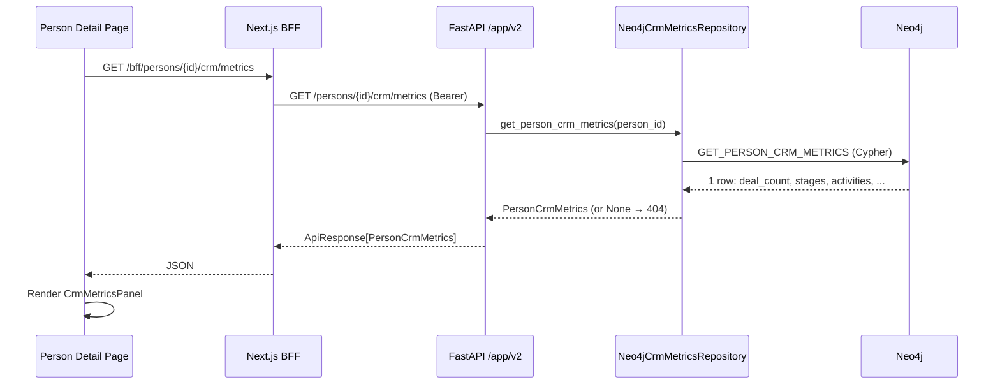

# Profile Unifier — Person CRM Metrics from Bitrix CRM Data

## Status

Implementation-ready design v3 (2026-08-19). Scope: calculate and display CRM engagement
metrics for a person from already-ingested Bitrix CRM source records, surfaced
in the active frontend2 person detail page. This is a read-only presentation
layer over existing graph data — no new ingestion, no new graph schema, no
analytical model.

Reading order: builds on
[`profile-unifier-graph-schema.md`](profile-unifier-graph-schema.md),
[`profile-unifier-crm-history-authority.md`](profile-unifier-crm-history-authority.md),
and [`profile-unifier-entity-and-sales.md`](profile-unifier-entity-and-sales.md).
Terms from [`profile-unifier-glossary.md`](profile-unifier-glossary.md).

---

## 1. Motivation

HyperP ingests CRM data from Bitrix (source key `bitrix_chat`) across four
stream types:

| Stream | `record_type` | `history_family` | Content |
|---|---|---|---|
| CRM Deals | `crm_deal` | — | Deal with title, category, stage, contacts |
| CRM Activities | `crm_history` | `activity` | Calls, emails, meetings, tasks |
| Calls | `call` | — | Companion call record (duration, direction, outcome) |
| Open Lines | `conversation` | — | WhatsApp / live-chat transcripts |

Today this data is only visible through the **Source records** tab (a flat
list filtered by type) and the **Timeline** tab (a chronological fact feed).
There is no consolidated, computed view answering:

- *How many CRM deals involve this person?*
- *What stages are those deals in?*
- *How many calls, emails, or meetings have happened?*
- *When was the last CRM activity?*
- *How does CRM engagement break down by entity (Fundbox / SpeedZone / Eko)?*

This design adds a dedicated **CRM** section to the person detail page that
computes these metrics on demand from existing `SourceRecord` nodes and
their `raw_payload` maps.

---

## 2. Scope and boundaries

### In scope

- `GET /v1/persons/{person_id}/crm/metrics` — aggregate CRM metrics for one
  person.
- BFF route handler proxying that endpoint.
- A **CRM** bento section on `persons/[personId]` with metric cards and
  breakdown tables.
- Typed Pydantic response models and TypeScript mirrors.
- Cypher query constants, repository protocol + Neo4j implementation, `deps.py`
  wiring, route catalog registration.
- OpenAPI spec and API spec documentation updates.
- Source-boundary enforcement: every metric includes only records emitted by
  the `bitrix_chat` source system.

### Out of scope

- No new ingestion, graph schema changes, or node labels.
- No `history_family = 'stage'` records — the [CRM History Authority
  Contract](profile-unifier-crm-history-authority.md) restricts analytical
  consumption to legacy-null or exactly `'activity'`. This design reads only
  the deal's current `stage_id` from `raw_payload`, not stage-transition
  history. Stage-history analytical release remains gated behind #148.
- No CRM WON 30-day prediction, scoring, or labels — that is the separate
  [Sales Prediction Discovery](profile-unifier-sales-prediction-discovery.md)
  track (`collect_more_data`).
- No aggregate/list-level CRM metrics across all persons.
- No write-back, caching, or materialized projections.

### Analytical boundary compliance

Every query filters CRM history records (and, for consistency, all record
types) with:

```cypher
(sr.history_family IS NULL OR sr.history_family = 'activity')
```

This matches the invariant in all existing person, source-record, timeline,
and profile-analysis readers (see [CRM History Authority Contract,
"Analytical disable boundary"](profile-unifier-crm-history-authority.md)).
Stage records (`history_family = 'stage'`) are excluded and fail closed.

Every record subquery also enforces the Bitrix source boundary:

```cypher
(sr IS NULL OR EXISTS {
  MATCH (sr)-[:FROM_SOURCE]->(:SourceSystem {source_key: 'bitrix_chat'})
})
```

The null-record escape preserves each one-row `OPTIONAL MATCH` subquery. Without
this boundary, the shared `conversation` record type would also count WhatsApp
chats from `whatsapp_chat`, which are outside CRM Open Lines engagement.

---

## 3. Available Bitrix CRM data

### 3.1 CRM Deal records (`record_type = 'crm_deal'`)

`SourceRecord` nodes linked to persons via `LINKED_TO`, to entities via
`OWNED_BY`, and to source systems via `FROM_SOURCE`. The deal envelope
(`_deal_envelope` in the Bitrix connector) populates `raw_payload` (a native
Neo4j map, not a JSON string) with:

| Key | Type |
|---|---|
| `crm_deal_id` | string |
| `title` | string |
| `category_id` | string \| null |
| `stage_id` | string \| null |
| `primary_contact_id` | string \| null |
| `primary_contact_kind` | `"contact"` \| `"lead"` \| null |
| `contact_count` | int |
| `crm_contact_ids` | list[string] |
| `deal` | map (full raw Bitrix deal object) |

The `SourceRecord` itself carries `observed_at`, `ingested_at`, `entity_key`,
and `lifecycle_status`.

### 3.2 CRM Activity records (`record_type = 'crm_history'`)

First-class properties on the `SourceRecord` node:

| Property | Meaning |
|---|---|
| `history_kind` | Normalized activity type (`call`, `email`, `meeting`, `task`, …) |
| `history_source` | Always `bitrix_crm_activity` |
| `event_at` | Deterministic activity event timestamp (from `start_at` or `observed_at`) |
| `parent_source_system` / `parent_source_record_id` | Parent deal ref |

`raw_payload` map contains `crm_activity_id`, `history_kind`, `subject`,
`direction`, `outcome`, `duration_seconds`, `start_at`, `end_at`, `activity`.

### 3.3 Call records (`record_type = 'call'`)

Companion to call activities. Same `raw_payload` shape, parent ref points to
the `crm_history` record.

### 3.4 Open Lines conversations (`record_type = 'conversation'`)

Chat transcripts with `conversation_ref` (channel, thread) and `raw_payload`
of messages. Already surfaced through Timeline and Source records tabs; the
CRM metrics view counts them but does not re-parse transcripts.

---

## 4. Metrics specification

### 4.1 `PersonCrmMetrics` model

```python
class CrmActivityKindCount(BaseModel):
    """Count of CRM activities grouped by normalized history_kind."""
    history_kind: str
    count: int
    last_event_at: str | None = None
    last_event_at_display: str | None = None


class CrmDealStageCount(BaseModel):
    """Count of CRM deals grouped by current stage_id from raw_payload."""
    stage_id: str | None = None
    count: int


class CrmEntityBreakdown(BaseModel):
    """Per-entity CRM record counts for a person."""
    entity_key: str
    entity_display_name: str | None = None
    deal_count: int = 0
    activity_count: int = 0
    conversation_count: int = 0


class PersonCrmMetrics(BaseModel):
    """Aggregate CRM engagement metrics for one person."""

    # Deal metrics
    deal_count: int = 0
    deal_stage_breakdown: list[CrmDealStageCount] = Field(default_factory=list)
    first_deal_at: str | None = None
    first_deal_at_display: str | None = None
    last_deal_at: str | None = None
    last_deal_at_display: str | None = None

    # Activity metrics
    activity_count: int = 0
    call_count: int = 0
    conversation_count: int = 0
    activity_kind_breakdown: list[CrmActivityKindCount] = Field(default_factory=list)
    first_activity_at: str | None = None
    first_activity_at_display: str | None = None
    last_activity_at: str | None = None
    last_activity_at_display: str | None = None

    # Per-entity breakdown
    entity_breakdown: list[CrmEntityBreakdown] = Field(default_factory=list)
```

### 4.2 Metric definitions

| Metric | Definition | Source |
|---|---|---|
| `deal_count` | Active `bitrix_chat` `crm_deal` records linked to the person | `LINKED_TO` + `FROM_SOURCE` + `record_type = 'crm_deal'` |
| `deal_stage_breakdown` | Distribution of deals by `raw_payload.stage_id` | Grouped count |
| `first_deal_at` / `last_deal_at` | Min/max `observed_at` among deals | `observed_at` |
| `activity_count` | Active `bitrix_chat` `crm_history` records (activity family only) | `record_type = 'crm_history'` + family/source filters |
| `call_count` | Active `bitrix_chat` `call` records | `record_type = 'call'` + source filter |
| `conversation_count` | Active Bitrix Open Lines `conversation` records | `record_type = 'conversation'` + source filter |
| `activity_kind_breakdown` | Count and last-event-time per `history_kind` | Grouped by `history_kind` |
| `first_activity_at` / `last_activity_at` | Min/max `event_at` (fallback `observed_at`) | `event_at` / `observed_at` |
| `entity_breakdown` | Per-entity deal/activity/conversation counts | `OWNED_BY` / `FROM_SOURCE`→`OPERATED_BY` |

Note: `call` records are excluded from `entity_breakdown` — they are a
companion to `crm_history` and already counted in top-level `call_count`.

### 4.3 Lifecycle and merge semantics

- **Lifecycle filter**: only records with `lifecycle_status = 'active'` or
  `(lifecycle_status IS NULL AND is_latest = true)`.
- **Link-active filter**: `coalesce(link.is_active, true) = true` on every
  `LINKED_TO` traversal, matching `GET_PERSON_BY_ID` and the listing query.
- **Merge chain resolution**: the query resolves
  `coalesce(canonical, p)` on `MERGED_INTO` (one hop; path-compressed) before
  traversing `LINKED_TO`. Metrics follow the survivor automatically.

---

## 5. Backend design

### 5.1 `services/api/src/types_crm.py`

```python
"""CRM metrics domain models."""

from __future__ import annotations

from pydantic import BaseModel, Field


class CrmActivityKindCount(BaseModel):
    history_kind: str
    count: int
    last_event_at: str | None = None
    last_event_at_display: str | None = None


class CrmDealStageCount(BaseModel):
    stage_id: str | None = None
    count: int


class CrmEntityBreakdown(BaseModel):
    entity_key: str
    entity_display_name: str | None = None
    deal_count: int = 0
    activity_count: int = 0
    conversation_count: int = 0


class PersonCrmMetrics(BaseModel):
    deal_count: int = 0
    deal_stage_breakdown: list[CrmDealStageCount] = Field(default_factory=list)
    first_deal_at: str | None = None
    first_deal_at_display: str | None = None
    last_deal_at: str | None = None
    last_deal_at_display: str | None = None
    activity_count: int = 0
    call_count: int = 0
    conversation_count: int = 0
    activity_kind_breakdown: list[CrmActivityKindCount] = Field(default_factory=list)
    first_activity_at: str | None = None
    first_activity_at_display: str | None = None
    last_activity_at: str | None = None
    last_activity_at_display: str | None = None
    entity_breakdown: list[CrmEntityBreakdown] = Field(default_factory=list)
```

### 5.2 `services/api/src/graph/queries/crm.py`

The query uses seven `CALL (person) { ... }` correlated subqueries (Neo4j 5.x
syntax, matching `persons_list.py`). Each subquery uses `OPTIONAL MATCH` and
returns **exactly one row** via aggregation (`count`, `min`, `max`) or
`collect(CASE WHEN ... IS NOT NULL THEN ... END)`. This prevents row fan-out
and ensures the outer query always produces one row when the person exists,
and zero rows (→ 404) when the person does not exist.

```python
"""Read-only Cypher for per-person CRM engagement metrics."""

from __future__ import annotations

# Shared predicates. These are static query fragments (literals), not
# parameterized values — the only parameter is $person_id. This matches the
# build_common_filter_clause pattern in persons_list_filters.py.

_LIFECYCLE = (
    "(sr.lifecycle_status = 'active' "
    "OR (sr.lifecycle_status IS NULL AND sr.is_latest = true))"
)

_LINK_ACTIVE = "coalesce(link.is_active, true) = true"

_ACTIVITY_FAMILY = "(sr.history_family IS NULL OR sr.history_family = 'activity')"

_BITRIX_SOURCE = (
    "(sr IS NULL OR EXISTS {"
    " MATCH (sr)-[:FROM_SOURCE]->(:SourceSystem {source_key: 'bitrix_chat'})"
    "})"
)

GET_PERSON_CRM_METRICS = f"""
MATCH (p:Person {{person_id: $person_id}})
OPTIONAL MATCH (p)-[:MERGED_INTO]->(canonical:Person)
WITH coalesce(canonical, p) AS person

// ── Deal count + date range (1 row) ──
CALL (person) {{
  OPTIONAL MATCH (sr:SourceRecord {{record_type: 'crm_deal'}})-[link:LINKED_TO]->(person)
  WHERE {_LINK_ACTIVE}
    AND {_LIFECYCLE}
    AND {_ACTIVITY_FAMILY}
    AND {_BITRIX_SOURCE}
  RETURN count(sr) AS deal_count,
         min(sr.observed_at) AS first_deal_at,
         max(sr.observed_at) AS last_deal_at
}}
// ── Deal stage breakdown (1 row, collected list) ──
CALL (person) {{
  OPTIONAL MATCH (sr:SourceRecord {{record_type: 'crm_deal'}})-[link:LINKED_TO]->(person)
  WHERE {_LINK_ACTIVE}
    AND {_LIFECYCLE}
    AND {_ACTIVITY_FAMILY}
    AND {_BITRIX_SOURCE}
  WITH sr
  // Guard each level: sr → raw_payload → stage_id. Neo4j property access on
  // null returns null (does not error), so the CASE safely yields null when
  // any level is absent.
  WITH CASE
         WHEN sr IS NOT NULL
          AND sr.raw_payload IS NOT NULL
          AND sr.raw_payload.stage_id IS NOT NULL
       THEN sr.raw_payload.stage_id
       END AS stage_id
  WITH stage_id, count(*) AS cnt
  ORDER BY stage_id
  RETURN collect(
    CASE WHEN stage_id IS NOT NULL THEN {{stage_id: stage_id, count: cnt}} END
  ) AS deal_stage_breakdown
}}
// ── Activity count + date range (1 row) ──
CALL (person) {{
  OPTIONAL MATCH (sr:SourceRecord {{record_type: 'crm_history'}})-[link:LINKED_TO]->(person)
  WHERE {_LINK_ACTIVE}
    AND {_LIFECYCLE}
    AND {_ACTIVITY_FAMILY}
    AND {_BITRIX_SOURCE}
  RETURN count(sr) AS activity_count,
         min(coalesce(sr.event_at, sr.observed_at)) AS first_activity_at,
         max(coalesce(sr.event_at, sr.observed_at)) AS last_activity_at
}}
// ── Activity kind breakdown (1 row, collected list) ──
CALL (person) {{
  OPTIONAL MATCH (sr:SourceRecord {{record_type: 'crm_history'}})-[link:LINKED_TO]->(person)
  WHERE {_LINK_ACTIVE}
    AND {_LIFECYCLE}
    AND {_ACTIVITY_FAMILY}
    AND {_BITRIX_SOURCE}
  WITH sr
  // Only coalesce to 'unknown' when sr exists but history_kind is null.
  // When sr itself is null (OPTIONAL MATCH found nothing), the CASE yields
  // null so the collect filters it out → empty list.
  WITH CASE WHEN sr IS NOT NULL THEN coalesce(sr.history_kind, 'unknown') END AS history_kind,
       CASE WHEN sr IS NOT NULL THEN coalesce(sr.event_at, sr.observed_at) END AS event_at
  WITH history_kind, count(*) AS cnt, max(event_at) AS last_event_at
  ORDER BY cnt DESC, history_kind
  RETURN collect(
    CASE WHEN history_kind IS NOT NULL THEN {{history_kind: history_kind, count: cnt, last_event_at: last_event_at}} END
  ) AS activity_kind_breakdown
}}
// ── Call count (1 row) ──
CALL (person) {{
  OPTIONAL MATCH (sr:SourceRecord {{record_type: 'call'}})-[link:LINKED_TO]->(person)
  WHERE {_LINK_ACTIVE}
    AND {_LIFECYCLE}
    AND {_ACTIVITY_FAMILY}
    AND {_BITRIX_SOURCE}
  RETURN count(sr) AS call_count
}}
// ── Conversation count (1 row) ──
CALL (person) {{
  OPTIONAL MATCH (sr:SourceRecord {{record_type: 'conversation'}})-[link:LINKED_TO]->(person)
  WHERE {_LINK_ACTIVE}
    AND {_LIFECYCLE}
    AND {_ACTIVITY_FAMILY}
    AND {_BITRIX_SOURCE}
  RETURN count(sr) AS conversation_count
}}
// ── Per-entity breakdown (1 row, collected list) ──
// Excludes 'call' records — there is no call_count field in CrmEntityBreakdown.
CALL (person) {{
  OPTIONAL MATCH (sr:SourceRecord)-[link:LINKED_TO]->(person)
  WHERE {_LINK_ACTIVE}
    AND {_LIFECYCLE}
    AND {_ACTIVITY_FAMILY}
    AND {_BITRIX_SOURCE}
    AND sr.record_type IN ['crm_deal', 'crm_history', 'conversation']
  OPTIONAL MATCH (sr)-[:OWNED_BY]->(record_entity:Entity)
  OPTIONAL MATCH (sr)-[:FROM_SOURCE]->(ss:SourceSystem {source_key: 'bitrix_chat'})
  OPTIONAL MATCH (ss)-[:OPERATED_BY]->(source_entity:Entity)
  WITH sr, coalesce(record_entity, source_entity) AS entity
  // Use CASE guards so that when sr/entity is null (OPTIONAL MATCH found
  // nothing), every column is null and the collect filters it out → empty
  // list. This avoids the WHERE entity IS NOT NULL pattern which would
  // eliminate the outer row when no records exist.
  WITH
    CASE WHEN entity IS NOT NULL THEN entity.entity_key END AS entity_key,
    CASE WHEN entity IS NOT NULL THEN entity.display_name END AS entity_display_name,
    CASE WHEN entity IS NOT NULL AND sr.record_type = 'crm_deal' THEN 1 ELSE 0 END AS is_deal,
    CASE WHEN entity IS NOT NULL AND sr.record_type = 'crm_history' THEN 1 ELSE 0 END AS is_activity,
    CASE WHEN entity IS NOT NULL AND sr.record_type = 'conversation' THEN 1 ELSE 0 END AS is_conversation
  WITH entity_key, entity_display_name,
       sum(is_deal) AS deal_count,
       sum(is_activity) AS activity_count,
       sum(is_conversation) AS conversation_count
  ORDER BY entity_display_name, entity_key
  RETURN collect(
    CASE WHEN entity_key IS NOT NULL THEN {{
      entity_key: entity_key,
      entity_display_name: entity_display_name,
      deal_count: deal_count,
      activity_count: activity_count,
      conversation_count: conversation_count
    }} END
  ) AS entity_breakdown
}}
RETURN deal_count,
       deal_stage_breakdown,
       first_deal_at,
       last_deal_at,
       activity_count,
       call_count,
       conversation_count,
       activity_kind_breakdown,
       first_activity_at,
       last_activity_at,
       entity_breakdown
"""
```

**Critical design notes:**

1. **No row fan-out**: Every `CALL (person) { ... }` subquery returns exactly
   one row. The deal-stage and activity-kind breakdowns collect their grouped
   results inside the subquery (returning a list), not as multiple rows. If
   any subquery returned multiple rows, subsequent subqueries would multiply
   the result set (cartesian product).

2. **Always-one-row guarantee via `OPTIONAL MATCH`**: Each subquery uses
   `OPTIONAL MATCH` (not `MATCH`), so when no records match, `sr` is null and
   the subquery still returns one row. `count(sr)` returns 0 (counts non-null
   values), `min`/`max` return null, and `collect(CASE WHEN ... IS NOT NULL
   THEN ... END)` returns `[]`.

3. **No `WHERE ... IS NOT NULL` after grouping**: A `WHERE entity IS NOT
   NULL` after `WITH` would filter out the null row and cause the subquery to
   return zero rows, eliminating the outer person row (→ spurious 404).
   Instead, the `CASE WHEN ... IS NOT NULL THEN ... END` pattern inside
   `collect` filters nulls in the output without eliminating the row.

4. **`link.is_active` filter**: Every `LINKED_TO` traversal includes
   `[link:LINKED_TO]` with `coalesce(link.is_active, true) = true`, matching
   `GET_PERSON_BY_ID` and the listing query. This excludes links marked
   inactive (e.g. during merge rewiring).

5. **`_ACTIVITY_FAMILY` on all subqueries**: Applied uniformly to deals,
   calls, and conversations (not just `crm_history`) for consistency with
   the CRM History Authority Contract, which says all readers (including
   call and conversation) should admit only legacy-null or `'activity'`.

6. **`raw_payload.stage_id` access**: `raw_payload` is a native Neo4j map
   (per the graph schema: `raw_payload: {}` — "native map, not a JSON
   string"). Cypher dot-notation `sr.raw_payload.stage_id` navigates the map.
   When `sr` or `raw_payload` is null, property access returns null (does not
   error). The `CASE` guard checks each level before using the value.

7. **`count(sr)` not `count(*)`**: `count(sr)` counts non-null values of
   `sr`, returning 0 when `OPTIONAL MATCH` finds nothing. `count(*)` would
   return 1 (counting the null row), which is wrong.

8. **Temporal comparison boundary**: `min`/`max` compare Neo4j temporal values
   directly so records with differing UTC offsets remain chronologically
   ordered. The repository's `to_iso_or_none` converter normalizes the selected
   driver temporal to an ISO 8601 string.

### 5.3 `services/api/src/repositories/protocols/crm.py`

```python
# Implementation shape (see the source file for the full strict-typed mapper):
#
# * _as_dicts narrows list[GraphValue] to non-null map rows.
# * _to_kind_count, _to_stage_count, and _to_entity_breakdown narrow nested maps.
# * _display_or_none applies format_display_date to a selected ISO timestamp.
# * _to_metrics converts the one aggregate row into PersonCrmMetrics, including
#   both raw ISO timestamps and their API-formatted display counterparts.
# * Neo4jCrmMetricsRepository runs the parameterized query and maps result.single().
```

**Mapper notes:**

- `_as_dicts` uses `isinstance` checks on `GraphValue` (matching
  `mappers_sales._as_dict`). The Cypher `collect(CASE WHEN ... IS NOT NULL
  THEN ... END)` already filters nulls, but the driver may return `[None]`
  in edge cases, so this is defense-in-depth.
- `to_int(row.get("deal_count"))` — `count(sr)` always returns an integer
  (0 when empty); `to_int` safely converts the `GraphValue` to `int`.
- `to_iso_or_none(row.get("first_deal_at"))` — the temporal `min(...)` returns
  null when empty; `to_iso_or_none` maps `None` to `None` and driver temporal
  values or strings to ISO strings.
- `_display_or_none` — applies the API display helper only after temporal
  conversion and preserves `None` when no date exists.
- `to_optional_str(row.get("history_kind")) or "unknown"` — the Cypher
  already coalesces null `history_kind` to `'unknown'` when records exist,
  but the `or "unknown"` is a secondary guard for the null-sr case that
  should have been filtered by `_as_dicts`.

### 5.5 Dependency wiring: `services/api/src/repositories/deps.py`

Add alongside the existing singletons:

```python
from src.repositories.neo4j.crm import Neo4jCrmMetricsRepository
from src.repositories.protocols.crm import CrmMetricsRepository

_crm_metrics_repo: CrmMetricsRepository = Neo4jCrmMetricsRepository()

def get_crm_metrics_repo() -> CrmMetricsRepository:
    return _crm_metrics_repo
```

### 5.6 `services/api/src/routes/person_crm.py`

```python
"""CRM metrics endpoint for the persons resource."""

from __future__ import annotations

from fastapi import APIRouter, Depends, Request

from src.auth.deps import require_scope
from src.http_utils import envelope, http_error
from src.repositories.deps import get_crm_metrics_repo
from src.repositories.protocols.crm import CrmMetricsRepository
from src.types import ApiResponse
from src.types_crm import PersonCrmMetrics

router = APIRouter(
    prefix="/v1/persons",
    tags=["Persons"],
    dependencies=[Depends(require_scope("persons:read"))],
)


@router.get(
    "/{person_id}/crm/metrics",
    response_model=ApiResponse[PersonCrmMetrics],
)
async def get_person_crm_metrics(
    person_id: str,
    request: Request,
    repo: CrmMetricsRepository = Depends(get_crm_metrics_repo),
) -> ApiResponse[PersonCrmMetrics]:
    """Return aggregate CRM engagement metrics for a person."""
    metrics = await repo.get_person_crm_metrics(person_id)
    if metrics is None:
        raise http_error(404, "person_not_found", "Person not found.", request)
    return envelope(metrics, request)
```

### 5.7 Route catalog: `services/api/src/route_catalog.py`

Add `person_crm` to imports and `FRONTEND_ROUTERS` (after `person_sales`):

```python
from src.routes import person_crm
...
FRONTEND_ROUTERS: tuple[APIRouter, ...] = (
    ...
    person_sales.router,
    person_crm.router,
    ...
)
```

This auto-registers the endpoint for both the authenticated frontend mount
and the MCP transport, satisfying the "every schema-visible FastAPI endpoint
must be exposed through MCP" requirement.

### 5.8 Query re-export: `services/api/src/graph/queries/__init__.py`

Add import from the new `crm` submodule and add to `__all__`:

```python
from src.graph.queries.crm import GET_PERSON_CRM_METRICS
```

---

## 6. Frontend design (frontend2)

### 6.1 TypeScript types in `services/frontend2/src/lib/api-types.ts`

Add after the `SalesOrder` interface:

```typescript
export interface CrmActivityKindCount {
  history_kind: string;
  count: number;
  last_event_at: string | null;
  last_event_at_display: string | null;
}

export interface CrmDealStageCount {
  stage_id: string | null;
  count: number;
}

export interface CrmEntityBreakdown {
  entity_key: string;
  entity_display_name: string | null;
  deal_count: number;
  activity_count: number;
  conversation_count: number;
}

export interface PersonCrmMetrics {
  deal_count: number;
  deal_stage_breakdown: CrmDealStageCount[];
  first_deal_at: string | null;
  first_deal_at_display: string | null;
  last_deal_at: string | null;
  last_deal_at_display: string | null;
  activity_count: number;
  call_count: number;
  conversation_count: number;
  activity_kind_breakdown: CrmActivityKindCount[];
  first_activity_at: string | null;
  first_activity_at_display: string | null;
  last_activity_at: string | null;
  last_activity_at_display: string | null;
  entity_breakdown: CrmEntityBreakdown[];
}
```

### 6.2 BFF route: `services/frontend2/src/app/bff/persons/[personId]/crm/metrics/route.ts`

```typescript
import type { NextResponse } from "next/server";

import type { PersonCrmMetrics } from "@/lib/api-types";
import { proxyToApi } from "@/lib/proxy";

export const dynamic = "force-dynamic";

interface RouteContext {
  params: Promise<{ personId: string }>;
}

export async function GET(
  _request: Request,
  context: RouteContext,
): Promise<NextResponse> {
  const { personId } = await context.params;
  return proxyToApi<PersonCrmMetrics>(
    `/persons/${encodeURIComponent(personId)}/crm/metrics`,
  );
}
```

### 6.3 UI component: `services/frontend2/src/components/CrmMetricsPanel.tsx`

The implemented component is a default-export `"use client"` component. It owns
one isolated React Query request (`useQuery`) through `bffFetch`, propagates the
aggregate section count through the required `onTotalLoaded` callback, and
renders metric cards, stage and activity breakdowns, date bounds, and an entity
table. Loading, empty, upstream-error, and 404 states remain local to the panel
so they cannot destabilize the person page.

Implementation shape:

- `CrmMetricsPanel` is the sole exported component and stays well below the
  150-line component budget.
- `CrmMetricCards`, `CrmBreakdowns`, `CrmStageBreakdown`,
  `CrmActivityBreakdown`, `CrmDateRange`, and `CrmEntityTable` are private
  cohesive sub-components; the complete module remains below 300 lines.
- Dates use the existing shared `formatDate` helper from `lib/display`.
- Activity labels use a local `titleCase` helper because no shared title-case
  utility exists; the helper is four lines and scoped to this module.
- Stage IDs render verbatim. A human stage-label catalog remains gated by #145.
- The component uses the scoped `CrmMetricsPanel.module.css` token-based styles;
  it does not import page-local person styles.

### 6.4 CSS: `services/frontend2/src/components/CrmMetricsPanel.module.css`

Use a scoped CSS module backed by the existing global design tokens
(`--border-subtle`, `--bg-card`, `--text-primary`, and `--text-muted`). The
module mirrors the person page's card visual language without importing its
page-local stylesheet.

### 6.5 Person page integration: `services/frontend2/src/app/persons/[personId]/page.tsx`

1. Import `CrmMetricsPanel`.
2. Add `"crm"` to the `Tab` type union.
3. Add `{ id: "section-crm", label: "CRM", count: tabTotals.crm }` to the
   `sections` memo (after `section-sales`).
4. Add a case in the section render switch:
   `case "section-crm": content = <CrmMetricsPanel personId={personId} onTotalLoaded={onCrmTotal} />; break;`
5. Add `const onCrmTotal = useCallback((n: number) => setTabTotals((t) => ({ ...t, crm: n })), []);`
6. Add a skeleton section in `PersonDetailSkeleton`.

### 6.6 BFF test

`services/frontend2/src/app/bff/__tests__/person-crm-metrics-route.test.ts` —
follows the pattern in `person-summary-route.test.ts`.

---

## 7. Display formatting

Human-facing dates are formatted by the API with the existing
`format_display_date` helper. Each raw ISO field has a matching nullable
`*_display` field (`first_deal_at_display`, `last_deal_at_display`,
`first_activity_at_display`, `last_activity_at_display`, and nested
`last_event_at_display`). The frontend renders those strings verbatim and uses
`—` only when no date exists. Counts are plain integers, and stage IDs and
`history_kind` remain source-facing values.

Stage display names (mapping Bitrix `stage_id` to human labels) would require
a server-side display helper in `display_format.py` and a `stage_display_name`
field in `CrmDealStageCount`, but depends on stage catalog probe data gated
by #145. Deferred to future work.

---

## 8. Testing strategy

### 8.1 Backend tests: `services/api/tests/test_person_crm_metrics.py`

Uses a typed fake session that accepts the query's `person_id` parameter. The
suite covers:

- all nested result fields and the exact query/parameter contract;
- the all-zero empty-person result;
- defensive discarding of null breakdown rows;
- `None` for an unknown person;
- driver temporal values converted to ISO strings and API display dates;
- seven isolated subqueries, seven active-link checks, seven lifecycle checks,
  seven activity-family checks, and seven `bitrix_chat` source checks;
- merge-survivor resolution;
- conversation and entity-breakdown record-type boundaries.

### 8.2 Route test

`test_person_crm_metrics_route.py` — verifies 200 response with metrics body,
404 for unknown person, and `persons:read` scope enforcement.

### 8.3 MCP parity test

`test_mcp_tools_match_every_canonical_api_operation` in
`test_mcp_app.py` automatically covers the new endpoint once registered in
`FRONTEND_ROUTERS`. The test asserts every OpenAPI operation ID has a
matching MCP tool. No manual edit needed.

### 8.4 Frontend tests

- `CrmMetricsPanel.test.tsx` — renders metric cards, breakdowns, entity
  table; loading, empty, error states.
- BFF route test verifying proxy behavior.

### 8.5 Lint and type checks

- `mypy --strict` on all new Python — no `Any`, explicit types.
- `npx eslint src` errors-only — no new warnings.
- Size limits: Python < 400 lines/module, < 50 lines/function; TS
  components < 150 lines, modules < 300 lines.

---

## 9. File checklist

### New files

| File | Purpose |
|---|---|
| `services/api/src/types_crm.py` | Pydantic models |
| `services/api/src/graph/queries/crm.py` | Cypher query |
| `services/api/src/repositories/protocols/crm.py` | Protocol |
| `services/api/src/repositories/neo4j/crm.py` | Neo4j implementation |
| `services/api/src/routes/person_crm.py` | FastAPI route |
| `services/api/tests/test_person_crm_metrics.py` | Backend tests |
| `services/api/tests/test_person_crm_metrics_route.py` | Route contract tests |
| `services/frontend2/src/components/CrmMetricsPanel.tsx` | UI component |
| `services/frontend2/src/components/CrmMetricsPanel.module.css` | Styles |
| `services/frontend2/src/components/__tests__/CrmMetricsPanel.test.tsx` | Frontend tests |
| `services/frontend2/src/app/bff/persons/[personId]/crm/metrics/route.ts` | BFF route |
| `services/frontend2/src/app/bff/__tests__/person-crm-metrics-route.test.ts` | BFF test |
| `services/frontend2/vitest.config.ts` | Resolve the production `@/` alias in tests |

### Modified files

| File | Change |
|---|---|
| `services/api/src/repositories/deps.py` | Add `_crm_metrics_repo` + `get_crm_metrics_repo()` |
| `services/api/src/route_catalog.py` | Import `person_crm`, add to `FRONTEND_ROUTERS` |
| `services/api/src/graph/queries/__init__.py` | Import + re-export `GET_PERSON_CRM_METRICS` |
| `services/frontend2/src/lib/api-types.ts` | Add CRM metrics interfaces |
| `services/frontend2/src/lib/generated/api-schema.ts` | Regenerate from the OpenAPI contract |
| `services/frontend2/src/app/persons/[personId]/page.tsx` | Import panel, add section + tab total |
| `docs/profile-unifier-openapi-3.1.yaml` | Add path + schemas |
| `docs/profile-unifier-api-spec.md` | Document endpoint |
| `README.md` | Add link to this design doc |
| `pyproject.toml` | Add the Pydantic model module to the existing strict-mypy override group |

---

## 10. Sequence diagram



---

## 11. Review changelog

### v1 → v2 fixes

1. **Row fan-out bug (critical)**: v1 used multiple `CALL` subqueries where
   some returned multiple rows (stage breakdown, kind breakdown, entity
   breakdown). This caused cartesian products — the final `RETURN` would
   execute N×M times and `collect()` would produce duplicates. v2
   restructures every subquery to return exactly one row by collecting
   grouped results inside the subquery.

2. **Spurious 404 on empty data (critical)**: v1 used `MATCH` (not
   `OPTIONAL MATCH`) in breakdown subqueries and `WHERE entity IS NOT NULL`
   after grouping. When no records matched, the subquery returned zero rows,
   eliminating the outer person row → spurious 404. v2 uses `OPTIONAL MATCH`
   everywhere and `collect(CASE WHEN ... IS NOT NULL THEN ... END)` to
   filter nulls in the output without eliminating the row.

3. **Missing `link.is_active` filter (correctness)**: v1 traversed
   `LINKED_TO` without checking `link.is_active`. v2 adds
   `coalesce(link.is_active, true) = true` on every traversal, matching
   `GET_PERSON_BY_ID` and the listing query.

4. **`call` records in entity breakdown (correctness)**: v1 included
   `'call'` in the entity breakdown filter but `CrmEntityBreakdown` has no
   `call_count` field. v2 excludes `'call'` from the entity breakdown.

5. **`_ACTIVITY_FAMILY` not applied to call/conversation (consistency)**: v1
   only applied the family filter to `crm_history` subqueries. v2 applies it
   to all subqueries for consistency with the CRM History Authority Contract.

6. **`history_kind` coalesce on null sr (correctness)**: v1 used
   `coalesce(sr.history_kind, 'unknown')` which turned the null-sr case
   into `history_kind = 'unknown'`, producing a spurious
   `{history_kind: 'unknown', count: 1}` entry. v2 guards with
   `CASE WHEN sr IS NOT NULL THEN coalesce(sr.history_kind, 'unknown') END`
   so null-sr yields null, filtered by the collect CASE.

7. **`count(*)` vs `count(sr)` (correctness)**: v1 used `count(*)` in the
   breakdown `WITH` clauses, which counts the null row from `OPTIONAL MATCH`
   as 1. v2 uses `count(*)` only in the grouped `WITH` (where it counts
   within each stage/kind group), and `count(sr)` for the top-level counts
   (which returns 0 when sr is null). Both uses are now correct.

8. **Repository mapper type safety**: v2 uses the converter pattern from
   `mappers_sales.py` (`to_int`, `to_iso_or_none`, `to_optional_str`,
   `_as_dicts`) instead of bare `row.get(...)` which returns `GraphValue |
   None` and would fail `mypy --strict`. This ensures every field is
   properly narrowed from the Neo4j driver's heterogeneous `GraphValue`
   type to the concrete Python type the Pydantic model expects.

### v2 → v3 implementation-review fixes

1. **Bitrix source boundary**: all seven record subqueries require
   `FROM_SOURCE` to the `bitrix_chat` SourceSystem. This prevents the shared
   `conversation` record type from counting WhatsApp chats from
   `whatsapp_chat` as CRM Open Lines engagement.
2. **Chronological temporal ordering**: date bounds are selected as Neo4j
   temporal values rather than pre-sorting ISO strings. This prevents
   differing UTC offsets from producing a lexicographic but non-chronological
   first/last result. Conversion to ISO strings remains at the repository
   boundary through `to_iso_or_none`.
3. **API-owned date presentation**: every raw timestamp has a matching nullable
   `*_display` field formatted through `format_display_date`, so the client does
   no date parsing or locale formatting.
4. **Frontend pattern alignment**: `CrmMetricsPanel` is a default-export
   client component and uses the existing React Query / BFF client pattern.
   It renders API-provided display strings and owns a scoped CSS module rather
   than importing page-local helpers or styles.
5. **Test runtime parity**: frontend tests resolve the same `@/` alias as the
   Next.js application through `vitest.config.ts`, keeping component imports
   consistent without test-only relative-import variants.

---

## 12. Future extensions

1. **Stage display names**: Map Bitrix `stage_id` to human labels via the
   stage catalog (gated by #145).

2. **List-level CRM summary**: `has_crm_deals` / `crm_activity_count`
   filters and a CRM count card in `PersonListSummary`.

3. **CRM activity timeline**: A dedicated chronological view of CRM
   activities with direction, outcome, and duration.

4. **Deal-to-order attribution**: Link CRM deals to sales orders to show
   conversion from deal to purchase.

5. **CRM WON 30-day metric**: Once the [Sales Prediction Discovery](profile-unifier-sales-prediction-discovery.md)
   gate passes, integrate `crm_won_30d`.

6. **Aggregated CRM metrics**: `GET /v1/persons/crm/summary` for
   cross-person statistics on a future dashboard page.
