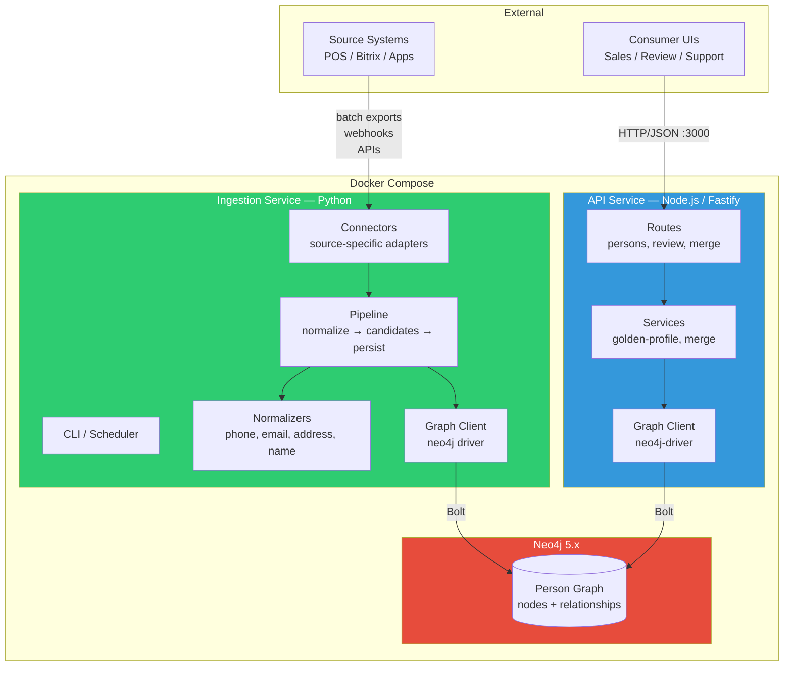
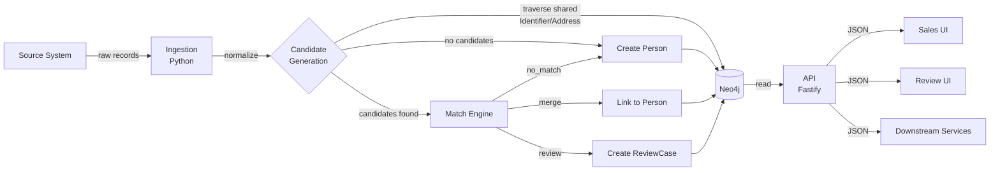
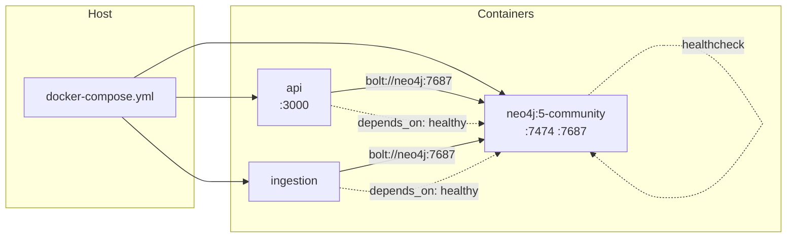

# Profile Unifier Scaffold Architecture

## Tech Stack

| Component | Technology | Purpose |
| --- | --- | --- |
| API service | Node.js + TypeScript, Fastify | search, person reads, review workflow, merge/unmerge |
| Ingestion service | Python 3.12+ | batch sync, normalization, candidate generation |
| Database | Neo4j 5.x | graph storage, traversal, ACID transactions |
| Deployment | Docker Compose | local dev and staging |
| Monorepo | single repo, multiple services | shared docs, infra, and deploy config |

## Repository Layout

```
hyperP/
├── docs/                              # design documentation (current)
│   ├── profile-unifier-*.md
│   └── profile-unifier-openapi-3.1.yaml
│
├── services/
│   ├── api/                           # Fastify TypeScript API
│   │   ├── src/
│   │   │   ├── server.ts              # entry point, graceful shutdown
│   │   │   ├── app.ts                 # Fastify instance, plugin registration
│   │   │   ├── config/
│   │   │   │   └── env.ts             # typed env config
│   │   │   ├── graph/
│   │   │   │   ├── client.ts          # Neo4j driver, session helper
│   │   │   │   └── queries.ts         # Cypher query constants
│   │   │   ├── routes/
│   │   │   │   ├── health.ts          # GET /health
│   │   │   │   ├── persons.ts         # search, get, source-records, connections,
│   │   │   │   │                      #   relationships, audit, matches
│   │   │   │   ├── review.ts          # review-cases, assign, unassign, actions
│   │   │   │   ├── merge.ts           # manual-merge, unmerge, locks
│   │   │   │   ├── survivorship.ts    # golden-profile recompute, survivorship-overrides
│   │   │   │   ├── ingest.ts          # ingest records, runs
│   │   │   │   ├── admin.ts           # source-systems, field-trust
│   │   │   │   └── events.ts          # GET /events
│   │   │   ├── services/
│   │   │   │   ├── golden-profile.ts  # recomputation logic
│   │   │   │   └── merge.ts           # merge/unmerge transaction logic
│   │   │   └── types/
│   │   │       └── index.ts           # TypeScript interfaces
│   │   ├── package.json
│   │   ├── tsconfig.json
│   │   ├── Dockerfile
│   │   └── .env.example
│   │
│   └── ingestion/                     # Python ingestion pipeline
│       ├── src/
│       │   ├── main.py                # CLI entry point
│       │   ├── config.py              # Pydantic settings
│       │   ├── pipeline.py            # orchestration: normalize → candidates → persist
│       │   ├── models.py              # Pydantic models (envelope, normalized types)
│       │   ├── graph/
│       │   │   ├── client.py          # Neo4j driver wrapper
│       │   │   └── queries.py         # Cypher write queries
│       │   ├── normalizers/
│       │   │   ├── phone.py           # E.164 normalization
│       │   │   ├── email.py           # lowercase, trim, validate
│       │   │   ├── address.py         # structured decomposition
│       │   │   └── name.py            # unicode normalization, placeholder detection
│       │   └── connectors/
│       │       └── base.py            # abstract SourceConnector interface
│       ├── pyproject.toml
│       ├── Dockerfile
│       └── .env.example
│
├── infra/
│   └── neo4j/
│       └── init.cypher                # constraints + indexes (run once)
│
├── docker-compose.yml                 # Neo4j + API + Ingestion
├── .env.example                       # root env (NEO4J_PASSWORD)
├── .gitignore
├── CLAUDE.md
└── README.md
```

## Service Architecture Diagram



## Data Flow



## Service Responsibilities

### API Service (Node.js + TypeScript + Fastify)

**Owns reads and workflow writes.** Does not own ingestion or normalization.

| Layer | Responsibility |
| --- | --- |
| Routes | HTTP endpoints matching the OpenAPI spec. Request validation, response envelopes, error codes. |
| Services | Business logic for merge transactions, golden profile recomputation, review state machine. |
| Graph Client | Neo4j driver singleton, session management, Cypher query execution. |
| Types | TypeScript interfaces matching the graph schema nodes and API response models. |

Key design rules:
- all merge/unmerge operations run in a single Neo4j ACID transaction
- golden profile recomputation is synchronous within the merge transaction
- all writes create audit trail (MergeEvent nodes)
- review actions validated against the state machine before execution

### Ingestion Service (Python)

**Owns source extraction, normalization, candidate generation, and initial
person creation.** Does not own review workflow or merge operations.

| Layer | Responsibility |
| --- | --- |
| Connectors | Source-specific adapters. Each implements `SourceConnector` (fetch_records, get_source_key). |
| Normalizers | Phone (E.164), email (lowercase+validate), address (structured decomposition), name (unicode+placeholders). |
| Pipeline | Orchestration: receive envelope → normalize → find candidates via graph traversal → evaluate match (stub in MVP) → persist nodes and relationships. |
| Graph Client | Neo4j driver wrapper, session management, Cypher write queries. |
| Models | Pydantic models for source envelope, normalized types, ingest results. |

Key design rules:
- all writes for a single source record run in one Neo4j transaction
- Identifier and Address nodes use `MERGE` (upsert) to prevent duplicates
- idempotency checked via `(source_system, source_record_id, record_hash)`
- new person creation produces a MergeEvent of type `person_created`
- match engine is stubbed in MVP (always creates new person)

## Neo4j Initialization

Constraints and indexes are defined in `infra/neo4j/init.cypher`. Run once
on a fresh database:

```bash
# Via docker exec
docker exec -i hyperp-neo4j-1 cypher-shell \
  -u neo4j -p $NEO4J_PASSWORD \
  < infra/neo4j/init.cypher

# Or via local cypher-shell
cypher-shell -a bolt://localhost:7687 \
  -u neo4j -p $NEO4J_PASSWORD \
  < infra/neo4j/init.cypher
```

The script is idempotent (`IF NOT EXISTS` on all constraints and indexes).

## Docker Compose Topology



Ports exposed to host:
- `3000` — API (HTTP/JSON)
- `7474` — Neo4j Browser (dev only)
- `7687` — Neo4j Bolt (dev only)

## Service Network Diagram

```
┌──────────────────────────────────────────────────────────────────┐
│  docker-compose network (default bridge)                         │
│                                                                  │
│  ┌──────────────────┐                     ┌────────────────────┐ │
│  │  API Service      │   bolt://neo4j:7687│  Neo4j 5.x         │ │
│  │  (Fastify/TS)     │◄──────────────────►│                    │ │
│  │                   │                    │  Bolt:  :7687       │ │
│  │  HTTP:  :3000     │                    │  HTTP:  :7474       │ │
│  │                   │                    │                    │ │
│  │  Reads:           │                    │  ┌──────────────┐  │ │
│  │  - person search  │   bolt://neo4j:7687│  │ Person Graph │  │ │
│  │  - connections    │◄──────────┐        │  │              │  │ │
│  │  - review queue   │           │        │  │ Identifier   │  │ │
│  │                   │           │        │  │ Address      │  │ │
│  │  Writes:          │    ┌──────┴──────┐ │  │ SourceRecord │  │ │
│  │  - merge/unmerge  │    │ Ingestion   │ │  │ MatchDecision│  │ │
│  │  - review actions │    │ Service     │ │  │ ReviewCase   │  │ │
│  │  - locks          │    │ (Python)    │ │  │ MergeEvent   │  │ │
│  └────────┬─────────┘    │             │ │  └──────────────┘  │ │
│           │               │ Writes:     │ │                    │ │
│           │               │ - ingest    ├─►                    │ │
│           │               │ - normalize │ │                    │ │
│           │               │ - candidate │ │                    │ │
│           │               │   gen       │ │                    │ │
│           │               │ - person    │ │                    │ │
│           │               │   creation  │ │                    │ │
│           │               └─────────────┘ └────────────────────┘ │
│           │                                                      │
└───────────┼──────────────────────────────────────────────────────┘
            │
            │  :3000 (HTTP/JSON)
            ▼
┌───────────────────────┐      ┌───────────────────────┐
│  Consumer UIs          │      │  Source Systems        │
│  - Sales dashboard     │      │  - POS                 │
│  - Review tool         │      │  - Bitrix CRM          │──► Ingestion
│  - Support portal      │      │  - Third-party apps    │    (batch/webhook)
│  - Downstream services │      └───────────────────────┘
└───────────────────────┘

Network rules:
  API ◄──► Neo4j     (Bolt, read + write)
  Ingestion ──► Neo4j (Bolt, write-heavy)
  API ✕ Ingestion     (no direct communication)
  Neo4j = shared state between services
```

## Environment Configuration

| File | Used by | Purpose |
| --- | --- | --- |
| `.env` | docker-compose | root password for Neo4j |
| `services/api/.env` | API service | local dev outside Docker |
| `services/ingestion/.env` | Ingestion service | local dev outside Docker |

When running via `docker-compose up`, only the root `.env` is needed.

### API Service Environment Variables

| Variable | Default | Required | Notes |
| --- | --- | --- | --- |
| `NEO4J_URI` | `bolt://localhost:7687` | no | use `bolt://neo4j:7687` in Docker |
| `NEO4J_USER` | `neo4j` | no | |
| `NEO4J_PASSWORD` | — | **yes** | |
| `PORT` | `3000` | no | |
| `LOG_LEVEL` | `info` | no | |

### Ingestion Service Environment Variables

| Variable | Default | Required | Notes |
| --- | --- | --- | --- |
| `NEO4J_URI` | `bolt://localhost:7687` | no | use `bolt://neo4j:7687` in Docker |
| `NEO4J_USER` | `neo4j` | no | |
| `NEO4J_PASSWORD` | — | **yes** | |
| `LOG_LEVEL` | `INFO` | no | |
| `BATCH_SIZE` | `1000` | no | records per transaction batch |

## Connector Extension Pattern

To add a new source system, create a new connector in
`services/ingestion/src/connectors/`:

```python
from src.connectors.base import SourceConnector

class BitrixConnector(SourceConnector):
    def get_source_key(self) -> str:
        return "bitrix"

    def fetch_records(self) -> Iterator[dict]:
        # source-specific extraction logic
        ...
```

Register the connector in the CLI entry point. The pipeline handles
everything from normalization onward.

## Implementation Order

Aligned with the [roadmap](./profile-unifier-roadmap.md):

1. **Neo4j setup** — docker-compose, init.cypher, verify constraints
2. **Graph client** — Neo4j driver wrappers for both services
3. **Normalizers** — phone, email, address, name
4. **Ingestion pipeline** — single-record flow, person creation, idempotency
5. **First connector** — batch adapter for the initial source system
6. **API read routes** — person search, get, source-records, connections
7. **API health** — Neo4j connectivity check
8. **Deterministic matching** — hard rules in the pipeline
9. **Review routes** — list, get, assign, actions
10. **Golden profile** — recomputation service, survivorship rules
11. **Merge/unmerge** — transaction logic, path compression, audit trail

## Recommendation

Start with steps 1–5 to get data flowing into Neo4j. Then build read APIs
(steps 6–7) so stakeholders can see results early. Matching and review
follow once the data foundation is proven.
