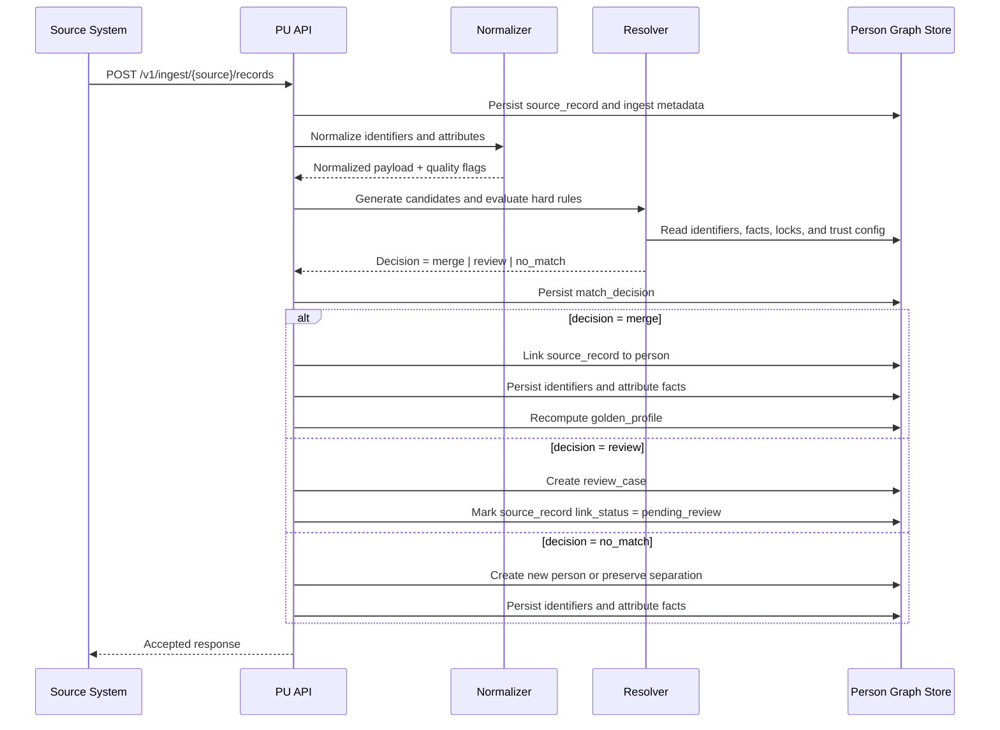
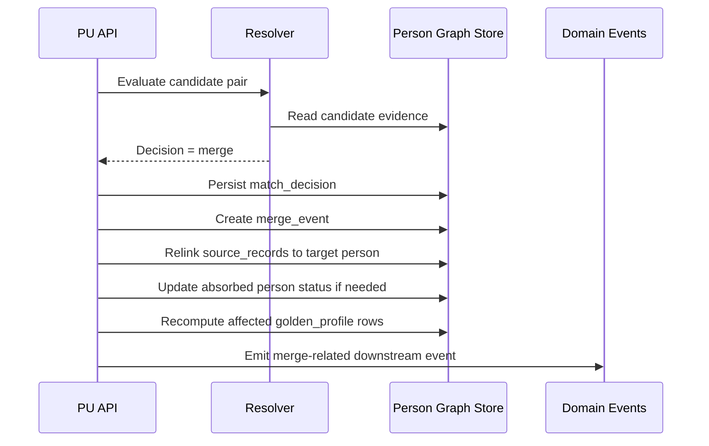
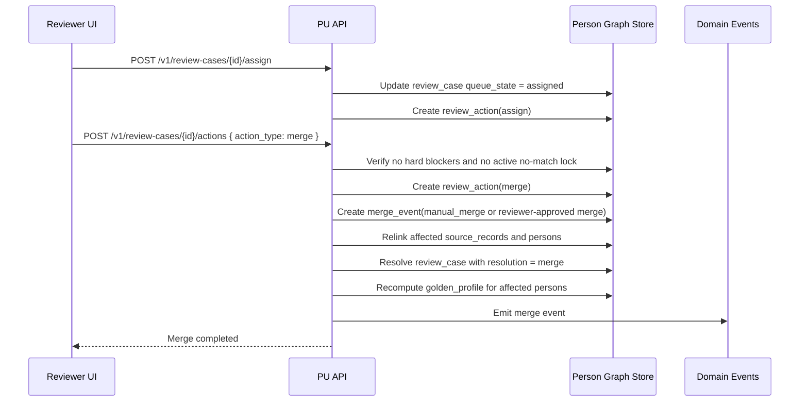
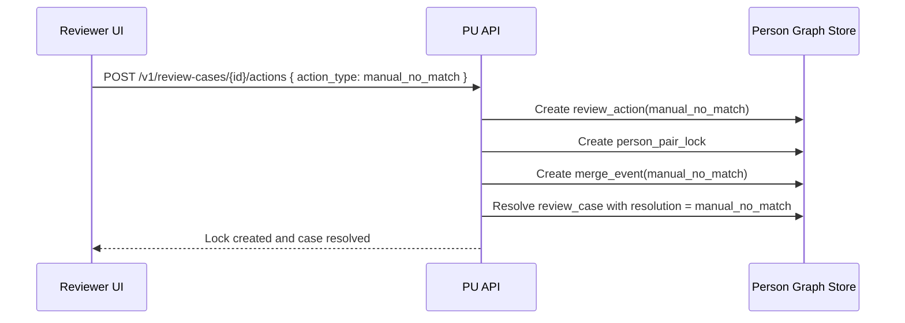
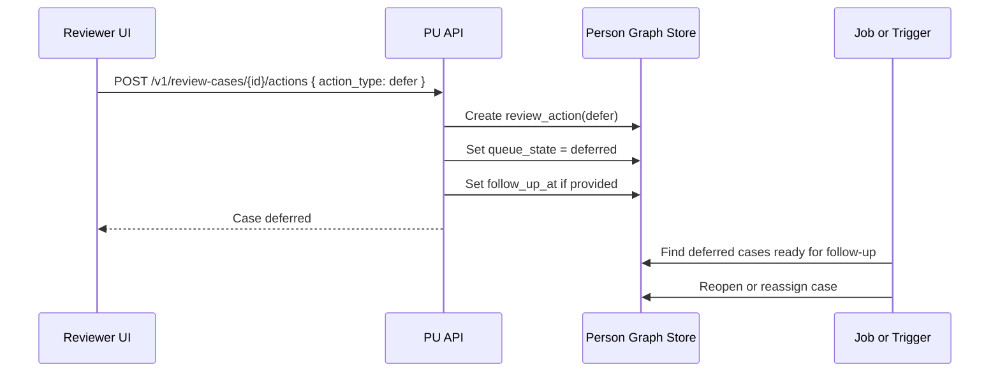
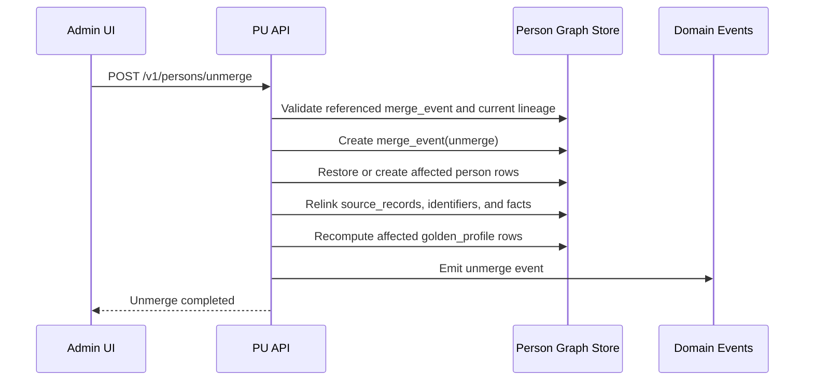
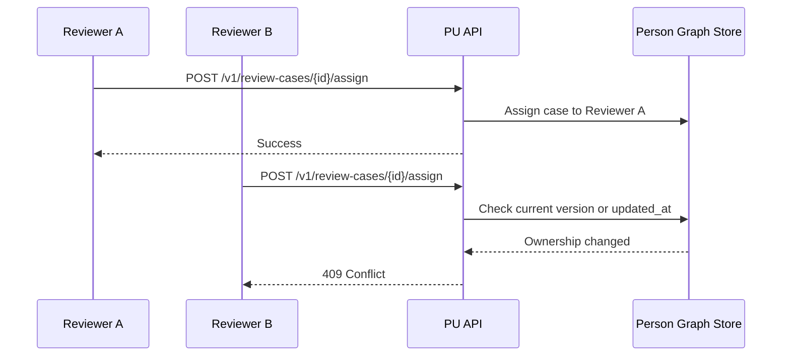
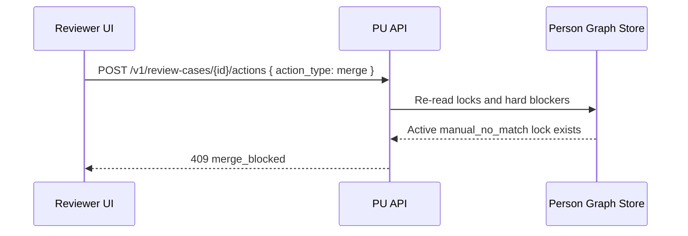

# Profile Unifier Sequence Diagrams

## Purpose

Illustrate the main runtime flows of the profile unifier platform so the
relationship between ingestion, matching, review, and audit side effects is
clear across teams.

## Diagram Conventions

- diagrams use Mermaid sequence syntax
- `PU API` represents the application API layer
- `Resolver` represents deterministic and probabilistic matching logic
- `Store` represents the OLTP persistence layer
- `Reviewer UI` represents the internal review tool

## Flow 1: Source Record Ingestion and Candidate Evaluation

## Flow 2: Deterministic or High-Confidence Auto-Merge

## Flow 3: Review Case Merge

## Flow 4: Review Case Manual No-Match

## Flow 5: Review Case Defer and Reopen

## Flow 6: Admin Unmerge

## Flow 7: Assignment Concurrency Conflict

## Flow 8: Review Merge Blocked by New Lock

## Recommended Reading Order

For implementation discussions, read these together:

1. [profile-unifier-architecture.md](./profile-unifier-architecture.md)
2. [profile-unifier-sql-schema.md](./profile-unifier-sql-schema.md)
3. [profile-unifier-api-spec.md](./profile-unifier-api-spec.md)
4. [profile-unifier-reviewer-workflow.md](./profile-unifier-reviewer-workflow.md)
5. this sequence-diagram document

## Recommendation

Use these diagrams to validate application boundaries and side effects before
writing migrations or service code. If implementation diverges from a diagram,
update the diagram together with the affected API, schema, or workflow doc.
